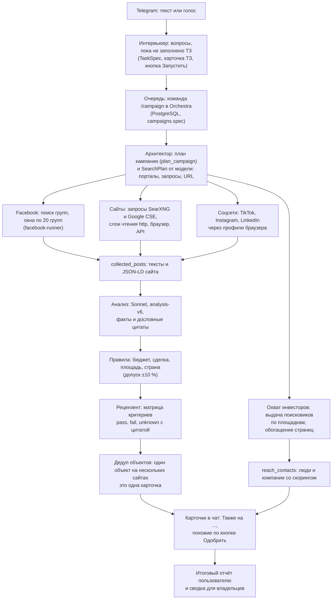

# Архитектура: путь задачи от сообщения до отчёта

Документ для оператора: что происходит с задачей пользователя, какой сервис
за что отвечает, какая модель на какой роли и какая миграция что добавила.
Подробности по частям: [CAMPAIGNS.md](CAMPAIGNS.md) (кампании и чат),
[WEB_SEARCH.md](WEB_SEARCH.md) (сайты), [INTERVIEW_TREE.md](INTERVIEW_TREE.md)
(вопросы), [HYBRID_AGENTS.md](HYBRID_AGENTS.md) (проект многоагентной схемы).
Прежний автономный бот в схему не входит: он лежит в [`legacy/`](../legacy/README.md).

## 1. Путь задачи

Шаги по порядку:

1. **Telegram.** Сервис `telegram` принимает текст и голос (голос расшифровывает
   OpenRouter). Пользователь выбирает режим («Участки и объекты» или
   «Инвесторы и компании»).
2. **Интервьюер** (`bot/control_plane/interviewer.py`). Один вызов модели на
   каждое сообщение: обновляет ТЗ `TaskSpec` (`bot/campaign/spec.py`) и задаёт
   один следующий вопрос. Что обязательно, решает код (`TaskSpec.missing_hard`),
   а не модель; «Не важно» закрывает поле, «Хватит, ищи» заканчивает опрос,
   лимит `INTERVIEW_MAX_ROUNDS`. Результат — карточка ТЗ с кнопками
   «Запустить / Изменить / Отмена»; без «Запустить» ничего не стартует.
3. **Очередь.** «Запустить» ставит команду `/campaign mode=… spec=…` в Orchestra
   (PostgreSQL). Диспетчер планирует кампанию детерминированно
   (`plan_campaign`, `bot/campaign/architect.py`) и сохраняет `campaigns.spec`.
4. **Архитектор.** Кроме детерминированного плана, веб-этап один раз за кампанию
   просит модель написать `SearchPlan` (`bot/campaign/search_plan.py`): порталы с
   приоритетом, запросы по языкам, прямые URL поиска порталов, правило остановки.
   Код выкидывает всё, чего нет в списке порталов страны и в `spec.sources`.
   Без ключа или при сбое остаётся прежний план по шаблонам.
5. **Сборщики** работают параллельно, каждый своим циклом внутри `campaign-runner`:
   - **Facebook:** поиск групп, окна по 20 групп как обычные batch, которые читает
     `facebook-runner`; те же квоты и предохранители, что у `/run`.
   - **Сайты** (`bot/web_search`): запросы уходят в SearXNG и, если включено, в
     Google CSE / SerpAPI; страницы читаются слоями **HTTP, затем браузер, затем
     scrape API** (последний выключен без ключа). Статус показывает слой.
   - **Соцсети** (`bot/social_search`): только там, где профиль залогинен через `/login`.
   - **Охват инвесторов** (`bot/campaign/reach.py`, только режим «Инвесторы»):
     выдача поисковиков по площадкам, затем одна публичная страница на результат
     (`bot/campaign/people.py`).
6. **Анализ.** `analysis-worker` читает `collected_posts`: детерминированные
   фильтры, затем Sonnet (`analysis-v6`) достаёт факты с дословными цитатами.
   Строка JSON-LD сайта стоит первой в тексте, цифры сайта главнее текста.
7. **Правила.** `bot/campaign/tolerance.py`: бюджет ±10 % (`BUDGET_TOLERANCE`),
   сделка, площадь, страна, неизвестная цена при заданном бюджете.
8. **Рецензент** (`bot/agents/reviewer.py`, `CAMPAIGN_JUDGE=reviewer`). Одна
   сильная модель на находку: каждый жёсткий критерий задачи получает
   `pass` / `fail` / `unknown` с цитатой. `fail` без настоящей цитаты становится
   `unknown`; любой `unknown` не даёт карточке стать точной (она «похожая»).
9. **Дедуп объектов** (`bot/campaign/dedup.py`). Тот же объект на другом сайте
   (цена ±2 %, площадь ±3 %, комнаты, адрес) не получает второй карточки: к
   первой дописывается «Также на: …». Объединение консервативное.
10. **Карточки** приходят по одной с хвостом «Найдено: N · ищу дальше»; похожие
    ждут «Одобрить».
11. **Итоговый отчёт** (`bot/campaign/final_report.py`): один раз, когда поиск
    закончен: сколько отправлено и отклонено по причинам, 10 лучших карточек,
    воронка по сайтам, непрочитанные сайты, 2–4 рекомендации.

Режим «Инвесторы» идёт тем же путём до шага 5, но его результат — люди и
компании: скоринг 0–100, один человек на разных площадках — одна карточка,
группы «Инвесторы и фонды», «Девелоперы», «Агенты и сети», «Компании».
Рецензент инвесторские находки не разбирает.

## 2. Сервисы `docker-compose.yml`

Сервисы стека по умолчанию (`docker compose up -d`):

| Сервис | Что делает |
|---|---|
| `postgres` | основная база: очередь команд, кампании, находки, посты, журнал аудита; миграции монтируются read-only |
| `redis` | аренды профилей браузера и блокировки; внутренняя сеть, наружу не открыт |
| `caddy` | единственные ворота: `127.0.0.1:8080` (`/healthz`) и HTTPS для живого браузера и страницы проверки (`/live/*`, `/verify/*`) |
| `telegram` | бот: доступ и роли, интервьюер, карточка ТЗ, голос, `/campaign`, `/run`, `/status`, диспетчер Orchestra |
| `campaign-runner` | ведёт кампании: поиск групп, окна Facebook, веб-этап (архитектор, запросы, чтение страниц), соцпоиск, охват инвесторов, рецензент, дедуп, карточки, итоговый отчёт |
| `searxng` | внутренний метапоиск для веб-этапа и охвата (только JSON, порт наружу не открыт) |
| `browser` | менеджер сессий Chromium: профили Facebook и соцсетей, чтение страниц, которые сайт рисует JavaScript или отказал по HTTP |
| `facebook-runner` | запускает batch групп Facebook (в том числе после Resume проверки) |
| `analysis-worker` | анализ постов (Sonnet, `analysis-v6`, цитаты), находки |
| `scrapling-worker` | разовое чтение одной публичной страницы по `/run website` |
| `agent-reach-worker` | разовое чтение страниц Instagram, TikTok, Facebook по `/run` |
| `verification` | проверки Facebook как Mini App: Claim, Open live browser, Solved, Resume |
| `reduction-worker` | теневая сводка Claude + Jev: пишет в `agent_reductions`, ничего не отправляет; простаивает при `AGENT_REDUCTION_ENABLED=false` |

Только по профилю или вручную: `facebook-collector` (профиль `collector`),
`agent-reach` (`agent-reach`), `scrapling-connector` (`scrapling`),
`analysis-pipeline` (`analysis`) — разовые прогоны; `gluetun` (закомментирован) —
необязательный VPN для веба. Сервиса автономного бота и `worker` в стеке нет.

## 3. Модели по ролям

Все вызовы идут через OpenRouter (`OPENROUTER_API_KEY`). Значения по умолчанию и
рекомендации взяты из `.env.example`: сильную модель имеет смысл ставить там, где
один вызов приходится на кампанию или находку, а не на каждую страницу.

| Роль | Переменная | По умолчанию | Рекомендуется |
|---|---|---|---|
| Интервьюер | `OPENROUTER_INTERVIEW_MODEL` | `anthropic/claude-sonnet-4.5` | `anthropic/claude-opus-4.5` |
| Архитектор (`SearchPlan`) | `OPENROUTER_PLAN_MODEL` | `anthropic/claude-sonnet-4.5` | `anthropic/claude-opus-5.5` |
| Запросы раундов | `OPENROUTER_WEB_QUERY_MODEL` | `openai/gpt-4o-mini` | без изменений |
| Анализ и извлечение (сборщик) | `OPENROUTER_ANALYSIS_MODEL` | `anthropic/claude-sonnet-4.5` | Sonnet |
| Рецензент | `OPENROUTER_REVIEW_MODEL` | `anthropic/claude-sonnet-4.5` | `anthropic/claude-opus-4.5` |
| Итоговый отчёт (рекомендации) | `OPENROUTER_FINAL_MODEL` | `anthropic/claude-sonnet-4.5` | `anthropic/claude-opus-4.5` |
| Прежний судья (`CAMPAIGN_JUDGE=legacy`, инвесторские находки) | `OPENROUTER_MATCH_MODEL` | `openai/gpt-4o-mini` | без изменений |
| Соцпоиск | `OPENROUTER_SOCIAL_MODEL` | `openai/gpt-4o-mini` | без изменений |
| Охват инвесторов | `OPENROUTER_REACH_MODEL` | `openai/gpt-4o-mini` | без изменений |
| Комментарии (лиды) | `OPENROUTER_LEADS_MODEL` | `openai/gpt-4o-mini` | без изменений |
| Теневая сводка: извлечение | `OPENROUTER_CLAUDE_MODEL` | `anthropic/claude-opus-5.5` | только при `AGENT_REDUCTION_ENABLED=true` |
| Теневая сводка: решение | `OPENROUTER_JEV_MODEL` | `~typesafe/jev-latest` | только при `AGENT_REDUCTION_ENABLED=true` |
| Голос | `STT_MODEL` | `openai/whisper-large-v3-turbo` | без изменений |

Без ключа каждая роль имеет запасной путь: интервьюера заменяют правила, план
остаётся по шаблонам, рецензент не вызывается (находка «похожая», пока
`CAMPAIGN_RELEVANCE_FAIL_CLOSED=true`), рекомендации отчёта пишутся правилами.

## 4. Миграции 031–039

Применяются `./scripts/apply_migrations.sh` по порядку, с проверкой контрольных
сумм. Последняя миграция сейчас 039.

| Миграция | Что делает |
|---|---|
| `031_task_draft_steps.sql` | черновик задачи можно сохранить на шагах `ask` и `target`: уточняющие вопросы не теряются |
| `032_web_seen_urls_ttl.sql` | страница поиска портала (`index`) перечитывается через `WEB_SEARCH_INDEX_TTL_DAYS`; число чтений в браузере хранится в базе |
| `033_campaign_finding_hold_reason.sql` | причина, по которой находка удержана непроверенной (ИИ-проверка не сработала), для владельцев |
| `034_web_fetch_layers.sql` | отказы и блокировки сайта по слоям (HTTP, браузер) и счёт чтений через scrape API |
| `035_campaign_specs.sql` | ТЗ (`TaskSpec`, JSON) в `campaigns.spec` и в черновике задачи |
| `036_campaign_finding_clusters.sql` | один объект на нескольких сайтах: `cluster_id`, `cluster_links`, `duplicate_of`, состояние `duplicate` |
| `037_reach_enrichment.sql` | обогащение охвата инвесторов: `enriched_at`, `contacts`, `profile_text`, `score` |
| `038_finding_review.sql` | матрица критериев рецензента (`review`), причина отказа или удержания (`why`), метка отправки итогового отчёта |
| `039_campaign_metrics.sql` | номер карточки (`card_number`), причина исключения без отправки (`agent_findings.reason`), слой, которым прочитана страница (`web_campaign_urls.layer`), итоги кампании в `campaign_metrics` для `/campaign report` |

Ранние миграции (001–030) описаны в README.

## 5. Что живое, что теневое, что проект

- **Живое:** интервьюер и `TaskSpec`, `SearchPlan`, слои чтения страниц, анализ
  `analysis-v6`, рецензент, дедуп, итоговый отчёт, режим «Инвесторы» со
  скорингом.
- **Теневое:** `reduction-worker` (Claude + Jev) пишет решения в
  `agent_reductions`, но ничего не отправляет.
- **Проект:** SA-5 … SA-7 (пакет трассы, рецензент Grok, автоприменение
  улучшений), см. [HYBRID_AGENTS.md](HYBRID_AGENTS.md).
